# Packages

- DB : Prisma, postgresql
- Logging : winston, ELK
- 썸네일 생성 : ffmpeg -> avif
- web server : nginx
- deploy : docker, pm2
  - application : 1core, 2GB
  - DB : 1core, 2GB
  - nginx : 1core, 512MB
  - elasticsearch : 1c, 2G
  - logstash : 1c, 2G
  - kibana : 1c, 2G

# ERD

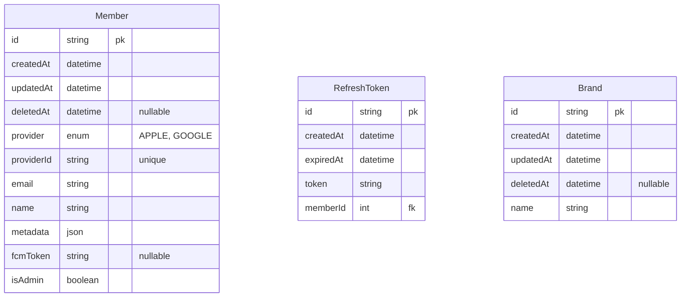

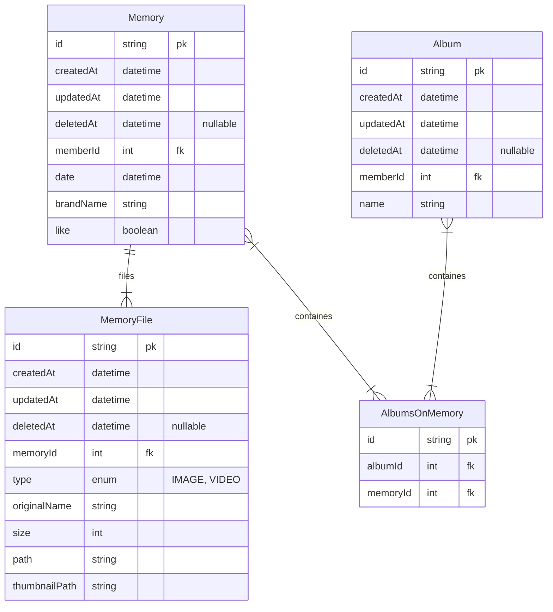

# Sequence Diagram

## Auth

### 로그인

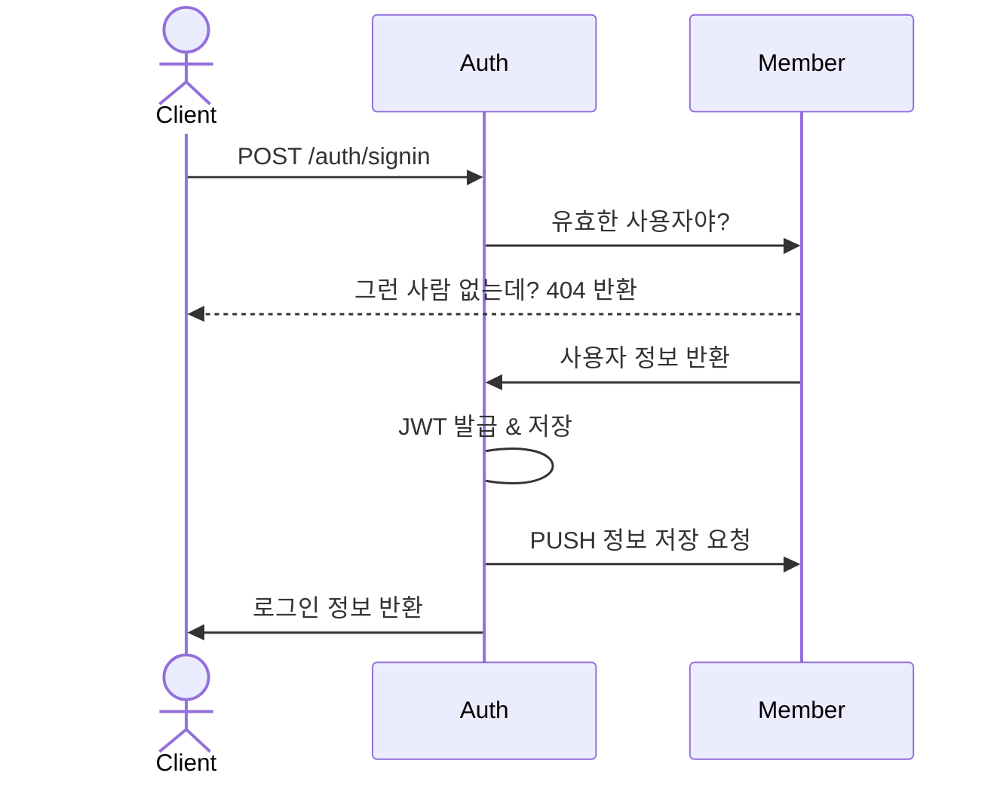

### 로그아웃

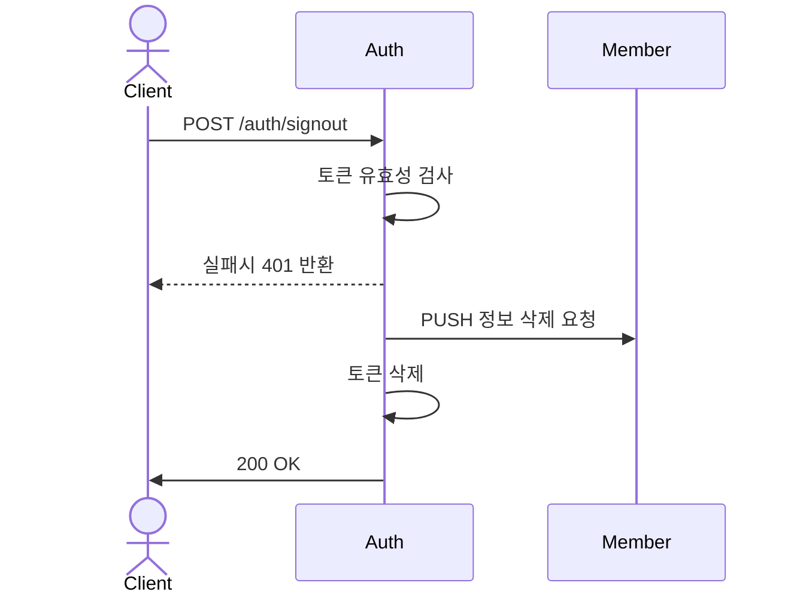

### 토큰 유효성 검사

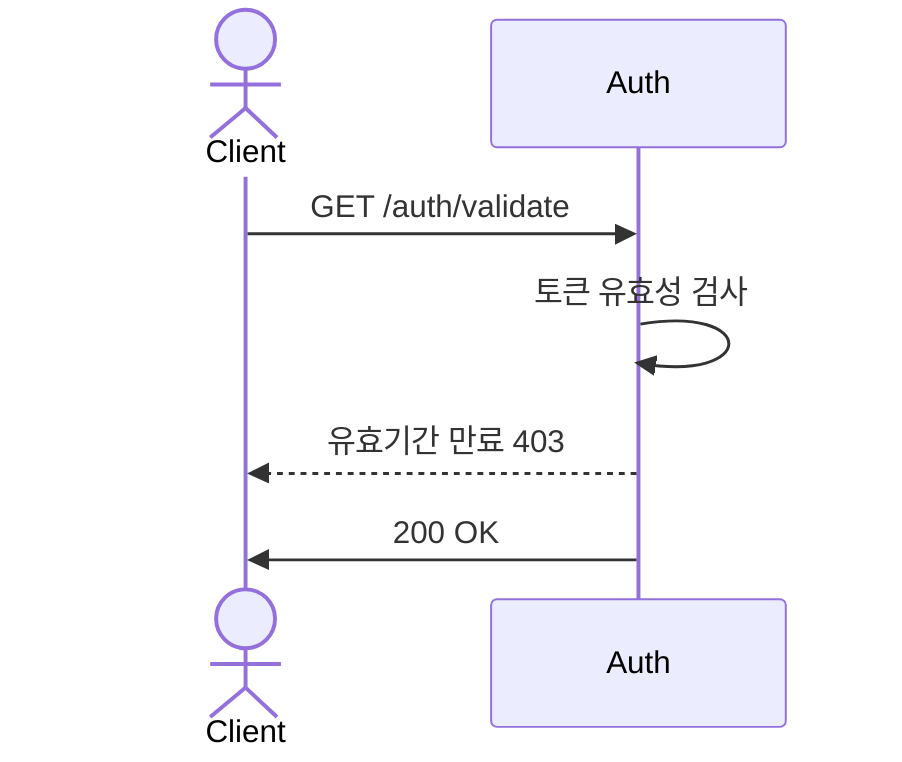

### 토큰 갱신

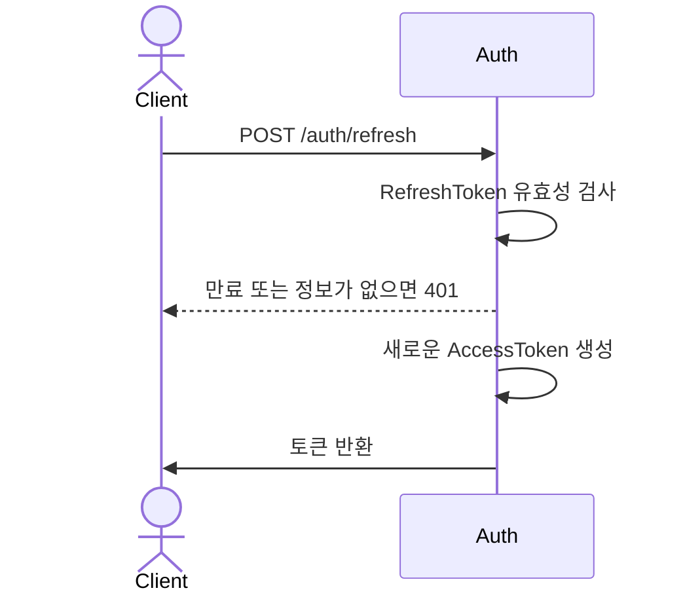

## User

### 회원가입

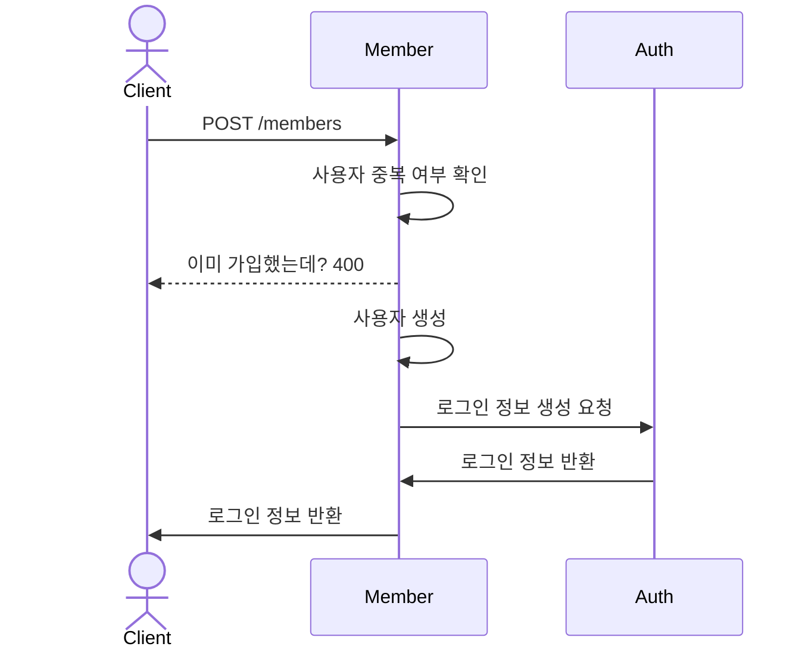

### 회원조회

### 회원탈퇴

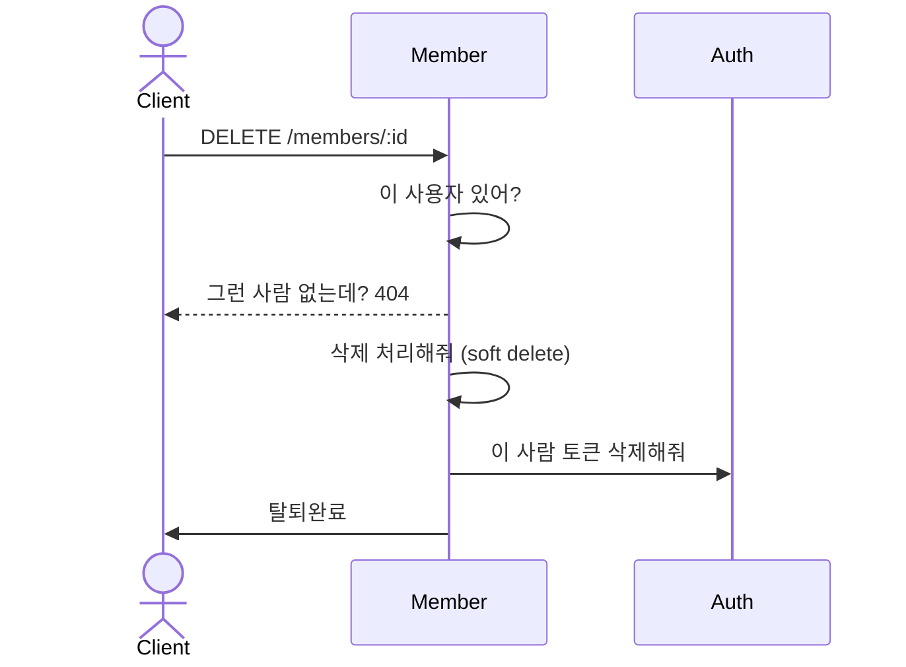

## Memory

### 파일 업로드

### 생성

### 리스트 조회

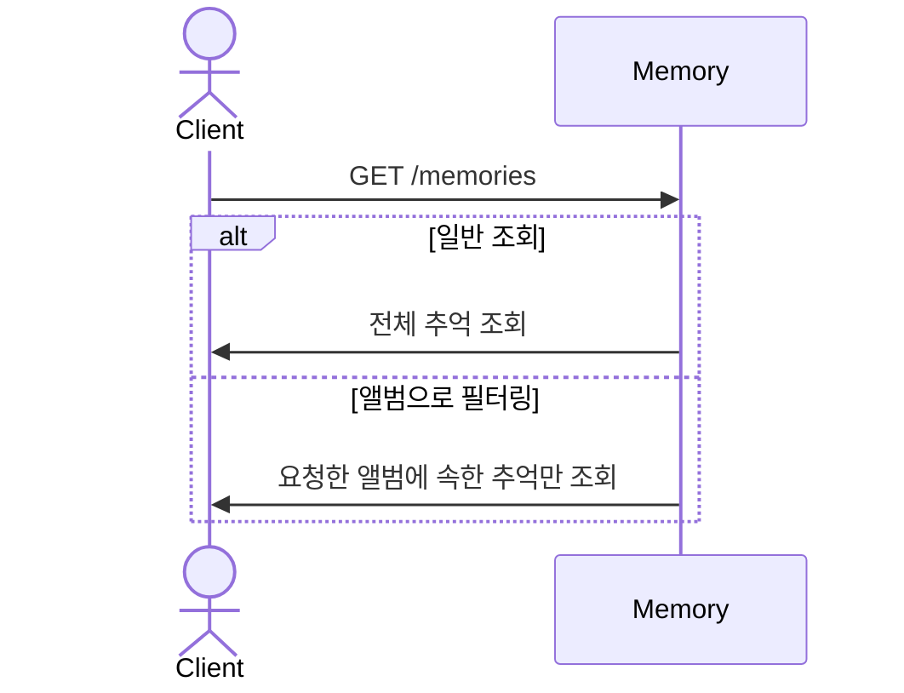

### 상세 조회

### 수정

### 삭제

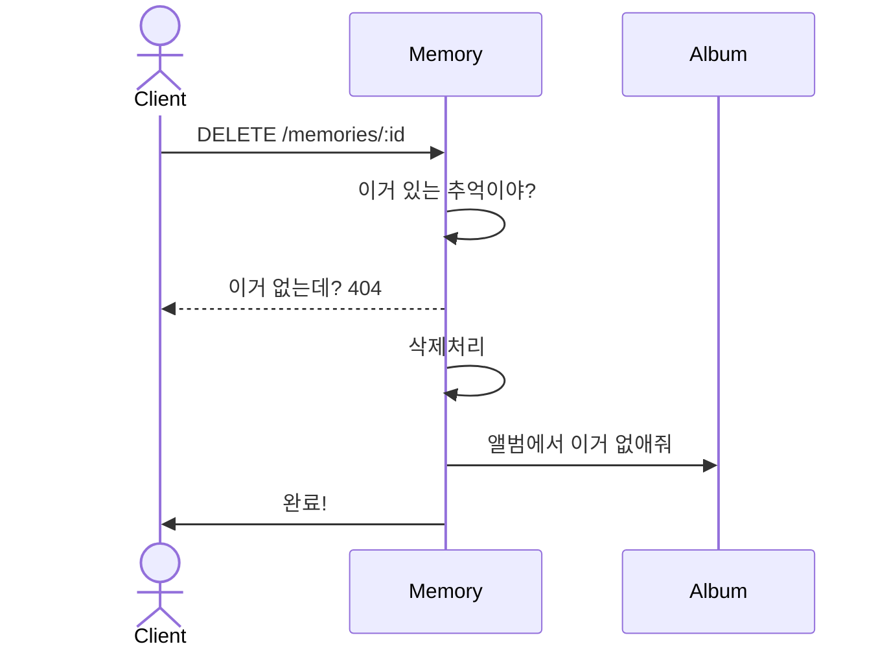

## Album

### 생성

### 목록 조회

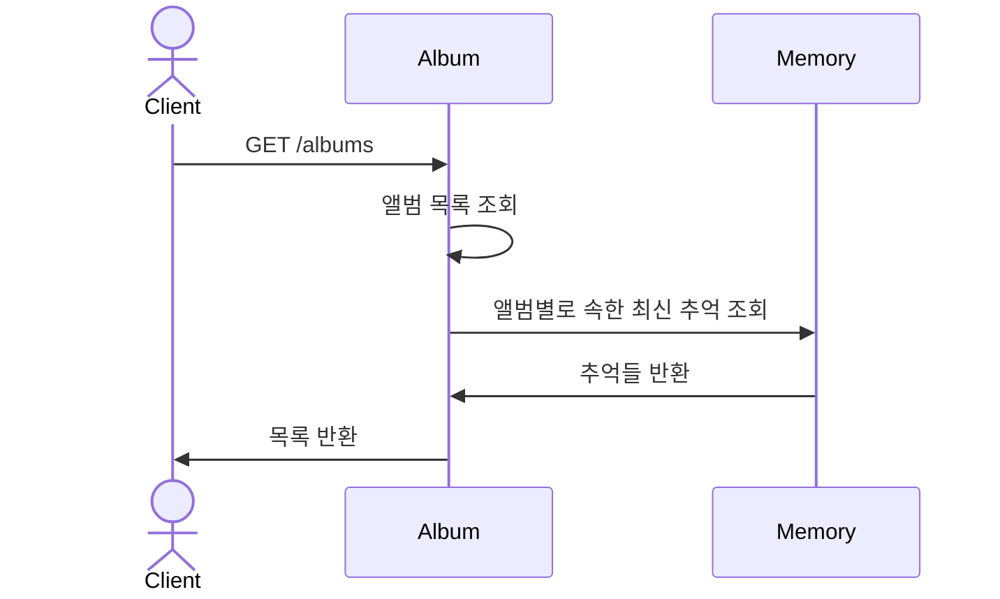

### 상세조회

### 수정

### 삭제

### 앨범에 추억 추가

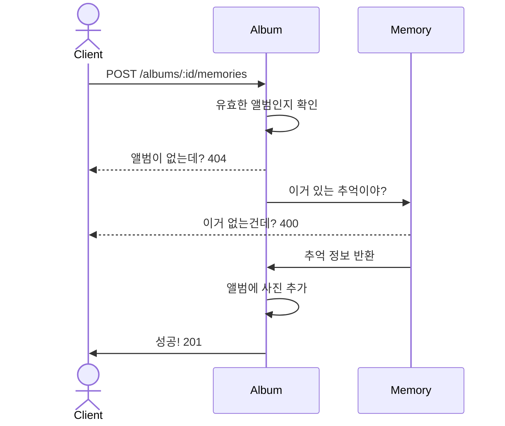

### 앨범에서 추억 삭제

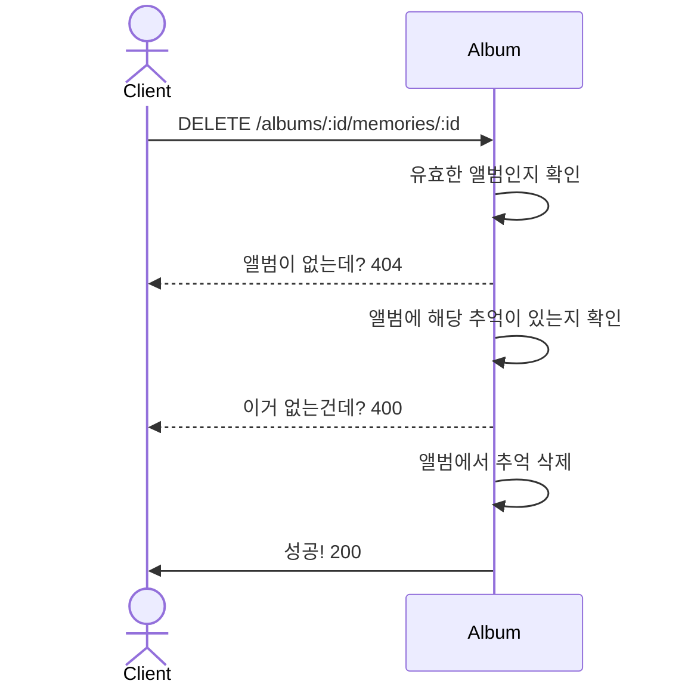

## Crawling

### 브랜드 목록 조회

### 크롤링 요청
